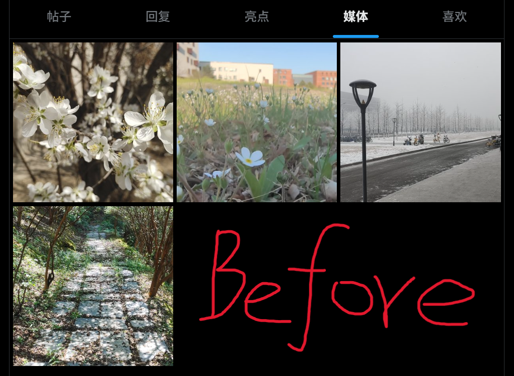
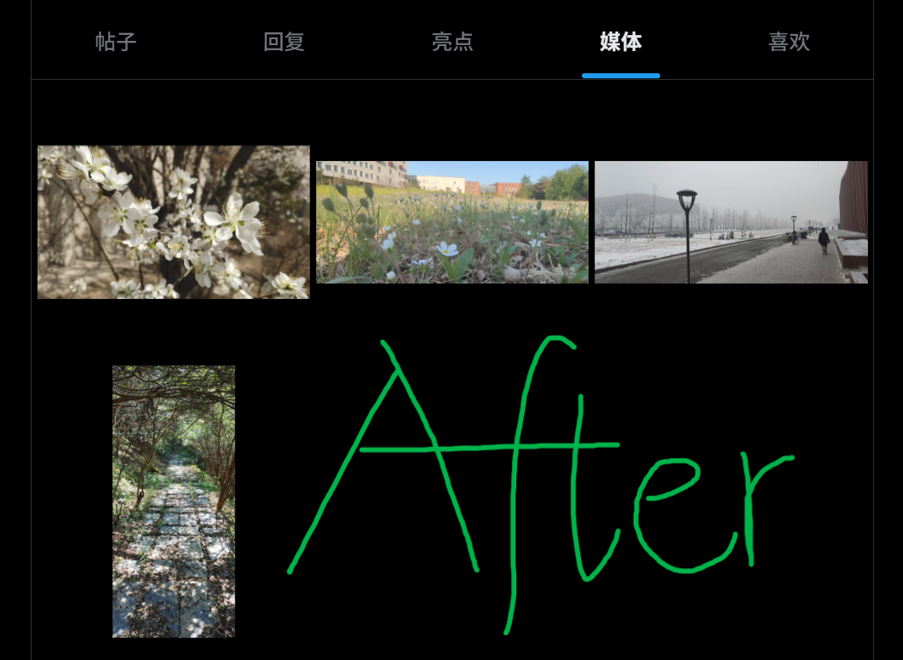

# X Media Full View · X 媒体网格完整显示

Tampermonkey 油猴脚本：让 X（Twitter）个人主页媒体标签页（`https://x.com/<用户名>/media`）的图片缩略图**按原始比例完整显示**，不再被默认的正方形裁切挡住全貌——一眼预览整张图，不用一张张点开。

## 效果图示

| 默认（正方形裁切，只看到局部） | 安装后（完整显示） |
| --- | --- |
|  |  |

竖图两侧留边、横图上下留边，每张图都完整可见。

## 功能特性

- 网格保持 X 原生排布，图片按原始比例完整显示：竖图两侧留边、横图上下留边；
- **无视频作者自动跳转照片**：点开"媒体"标签页时 X 默认展示视频筛选；如果该作者没有发布过视频，脚本会自动跳转到照片页，不用再手动切换（作者有视频时不干预，保持 X 原生行为）；
- 点击看大图、悬停变暗、滚动无限加载均不受影响；
- GIF / 视频缩略图同样完整显示；
- 仅在 `/用户名/media` 页面生效，其余页面零改动。

## 安装

1. 浏览器安装 [Tampermonkey](https://www.tampermonkey.net/) 扩展；
2. 点击安装：**[安装脚本（点这里）](https://raw.githubusercontent.com/LiSeafood/x-media-fullview/main/x-media-fullview.user.js)** ，Tampermonkey 会自动弹出安装页；
3. 强制刷新一次 X（`Ctrl+F5`）。

> 手动安装：复制 [x-media-fullview.user.js](x-media-fullview.user.js) 全部内容 → Tampermonkey 管理面板 → 「添加新脚本」→ 粘贴并保存。

## 更新日志

- **v7.1**：新增"无视频作者自动跳转照片筛选"（SPA 方式跳转，带兜底）。
- **v7.0**：重构为纯 CSS + URL 门控方案，根治"时灵时不灵"。

## 兼容性说明

脚本基于 2026-10 实测的 X 前端 DOM（`data-testid="cellInnerDiv"`、内联 `background-image`、`data-testid="emptyState"` 等稳定特征编写，不依赖随版本变化的 `.r-xxxx` 原子类名）。X 改版可能导致失效，欢迎提 [issue](https://github.com/LiSeafood/x-media-fullview/issues)。

## License

[MIT](LICENSE)
